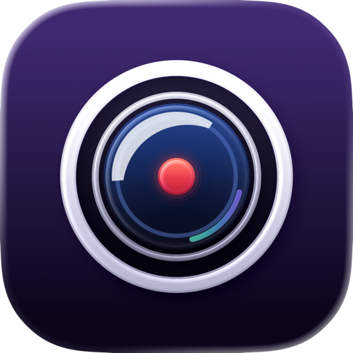

<p align="center">
  
</p>

<h1 align="center">Camcord</h1>

<p align="center">
  <strong>Native screenshots, scrolling captures and screen recording for your Mac.</strong><br>
  Capture with one shortcut, mark it up in place, and record with your camera and sound. Nothing leaves your Mac.
</p>

<p align="center">
  <a href="https://github.com/tunatavsan/camcord/actions/workflows/ci.yml"></a>
  <a href="LICENSE"></a>
  
  
</p>

Camcord lives in the menu bar for quick captures and opens a main window when you need more: a Library of everything
you captured, an Editor for screenshots, a Studio for setting up recordings, and Settings. It is written in Swift on
top of ScreenCaptureKit, AVFoundation and Vision, and it is designed for macOS 26 and Liquid Glass.

## Why Camcord

- **Native and fast.** SwiftUI and AppKit, no web views. A capture is taken from pixels sampled before the selection
  overlay appears, so what you select is exactly what you get.
- **Your shortcuts.** No shortcut is assigned for you. Choose your own keys in Settings, or hold a mouse side button to
  select a region.
- **Windows as you see them.** A translucent terminal or a sidebar with a blurred backdrop is captured and recorded the
  way it looks on screen, not flattened.
- **Recordings that hold up.** System audio and microphone are mixed into the first audio track so every player hears
  both. If something fails mid-recording, the partial file is kept and reported instead of silently discarded.
- **Private.** Camcord makes no network connections, collects no analytics and needs no account. Text recognition runs
  on your Mac.

## Features

| | |
| --- | --- |
| **Capture** | A region, a window or the whole screen, from the menu bar, the main window or a global shortcut. After each shot a card slides in: drag the image into another app, save it, pin it or open it in the Editor. |
| **Scrolling capture** | Stitches a long page, or the part of a window that scrolls, into one image. Scroll by hand or let Camcord scroll for you; sticky headers and footers are detected so they appear once. |
| **Text** | Recognizes the text in a region with on-device Vision, keeping reading order, paragraphs and code indentation, and decodes QR codes and barcodes in the same pass. |
| **Pin** | Keeps a screenshot floating above your windows. Pinch on a trackpad to zoom into it. |
| **Editor** | Arrows, boxes, text, highlights, numbered steps, blur, pixelation, solid redaction and crop. Exports a flattened copy and keeps the original. |
| **Recording** | Records a display, a window or a region, with system audio, a microphone, an optional floating camera, a countdown, and pause and resume. HEVC or ProRes, in MOV or MP4. |
| **Studio** | Sets up a recording before you start: pick the source, check the camera and audio levels, and add text or image layers. |
| **Library** | Every capture in one place, with Quick Look, sharing, Finder actions and controls for how long cached screenshots are kept. |

Camcord is available in English and Turkish.

## Getting started

Camcord is an early preview. Signed and notarized downloads are not available yet, so for now you build it from
source.

**Requirements:** macOS 26 or later and Xcode 26.5 or later (Swift 6.2).

```sh
git clone https://github.com/tunatavsan/camcord.git
cd camcord
scripts/build.sh --ad-hoc
open dist/Camcord.app
```

`scripts/build.sh` builds a release copy into `dist/Camcord.app`. `--ad-hoc` signs it without a certificate, which is
enough to try Camcord. macOS ties capture permissions to the app's signature, so an ad hoc build may ask for Screen
Recording permission again after every rebuild.

For day-to-day use, sign with a stable certificate from your keychain (an Apple Development certificate works) and
install into `/Applications`:

```sh
CAMCORD_SIGN_IDENTITY="Apple Development: Your Name (TEAMID)" scripts/build.sh --install
```

Without `CAMCORD_SIGN_IDENTITY` the script reuses the identity of the installed copy, or the only signing identity in
your keychain. `scripts/dev-setup.sh` checks your setup. Installation refuses to replace a running Camcord and keeps the
previous copy as a backup.

### Permissions

| Permission | Needed for |
| --- | --- |
| Screen Recording | Every screenshot and recording. Camcord asks for it on first run. |
| Microphone | Recording your voice, only when you turn the microphone on. |
| Camera | The floating camera and camera recording, only when you turn the camera on. |
| Accessibility | Automatic scrolling, mouse side-button capture and trackpad gestures on pinned screenshots. |

You can review each one in **System Settings › Privacy & Security**. Camcord never changes them for you.

Screenshots are copied to the clipboard; saving a file as well is a setting. Recordings are saved to the folder you
choose. To silence notifications while you record, point Camcord at your own Shortcuts for turning a Focus on and off;
macOS has no public API for changing Focus directly.

## Development

Camcord is a Swift package with no Xcode project. Its only third-party code is
[KeyboardShortcuts](https://github.com/sindresorhus/KeyboardShortcuts), vendored under `Packages/`, so a build never
downloads anything.

```sh
swift build          # build the app
swift test           # run the test suites
scripts/check.sh     # what CI runs: a build that treats warnings as errors, then every test
```

Tests use Swift Testing. They run without Screen Recording permission and never touch your real settings, Library or
clipboard; tests that need a live display or devices only run when you opt in. CI runs the suites serially and skips
the few pixel, window-placement and sampler checks that need a real Mac's display and GPU.

| Folder | Purpose |
| --- | --- |
| `Sources/Camcord/Capture` | Screenshots, window and region geometry, scrolling capture and stitching, text and barcode recognition. |
| `Sources/Camcord/Recording` | The ScreenCaptureKit stream, the `AVAssetWriter` pipeline, audio mixing, the camera and its compositor. |
| `Sources/Camcord/Overlay` | Everything drawn over other apps: the selection overlay, the screenshot card, pins and the recording controls. |
| `Sources/Camcord/Hotkeys` | Global keyboard shortcuts and the event tap for mouse buttons. |
| `Sources/Camcord/App` | The menu-bar panel, the main window and its Library, Editor, Studio and Settings, and the design system. |

[ARCHITECTURE.md](ARCHITECTURE.md) explains how a capture and a recording flow through these parts.

## Roadmap

- [ ] Signed, notarized releases and a Homebrew cask
- [ ] Screenshots of the app in this README, once the interface settles
- [ ] A timeline for trimming recordings
- [ ] More languages

Ideas and bug reports are welcome in [Issues](https://github.com/tunatavsan/camcord/issues).

## Contributing

Contributions are welcome. Please read [CONTRIBUTING.md](CONTRIBUTING.md) before opening a pull request, and report
security or privacy problems privately as described in [SECURITY.md](SECURITY.md).

## License

Camcord is released under the [MIT License](LICENSE). Third-party components are listed in
[THIRD-PARTY-NOTICES.md](THIRD-PARTY-NOTICES.md).
